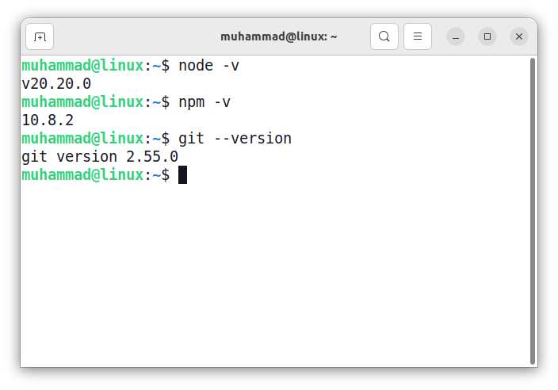
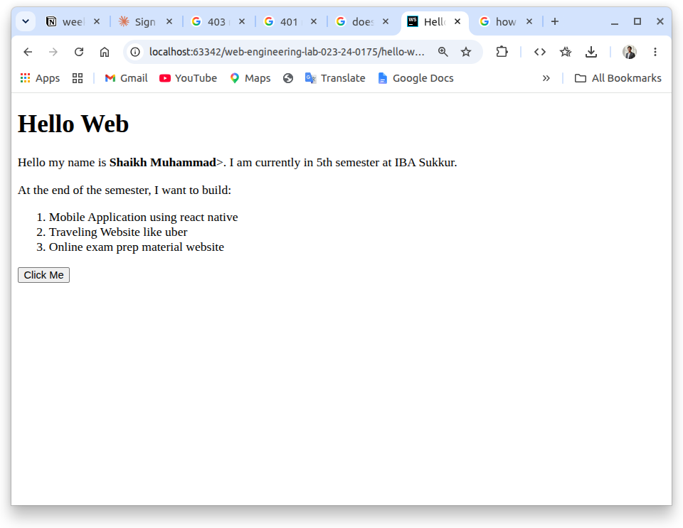
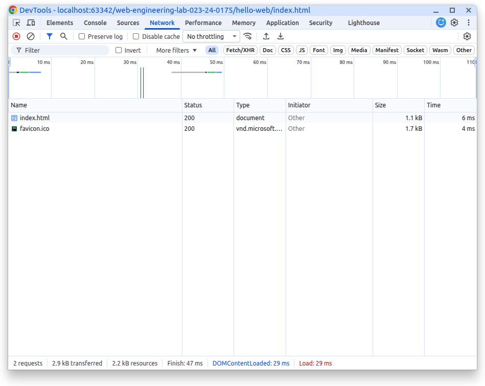
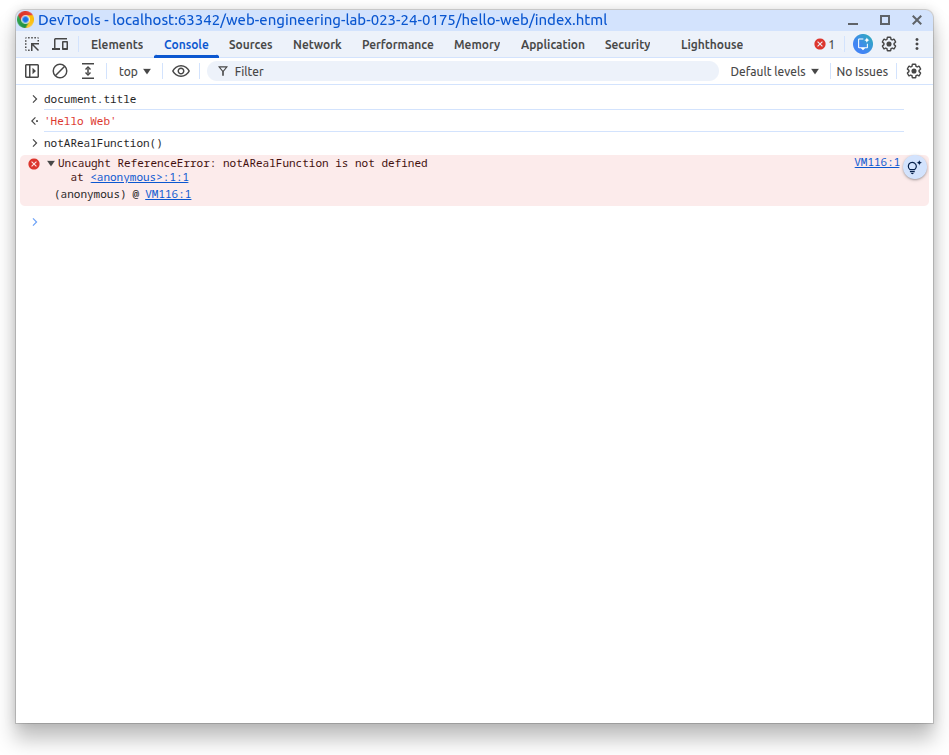
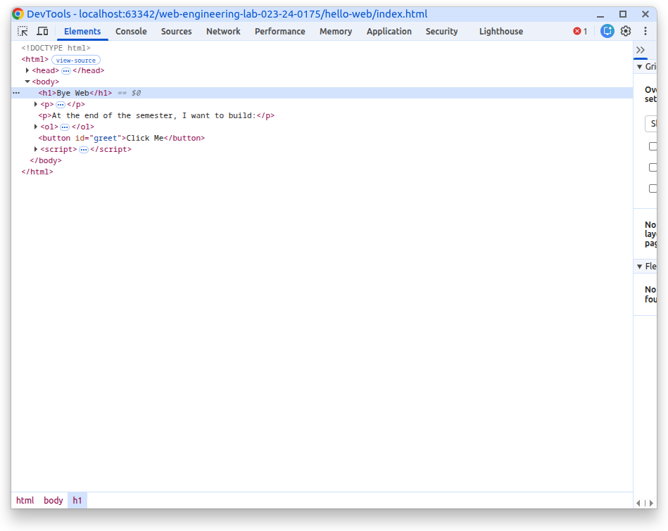
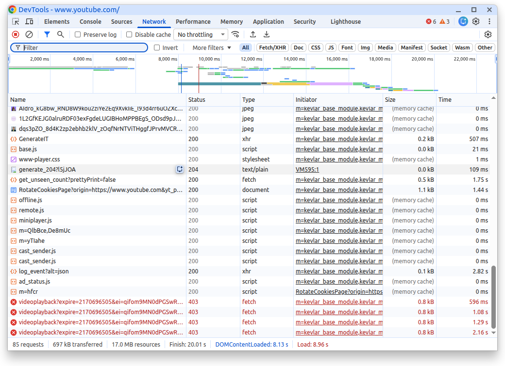

# Week Zero

## Class Activities:

### Task A: Client vs Server
* **Client does:** Shows you the video and let us play, pause, skip video.
* **Server does:** Keeps the actual video files and sends video in response when requested by client.
* **If network fails mid-load:** Video freezes — nothing new is coming in, so there's nothing new to show.

### Task B: URL Teardown

**Url:** https://www.google.com/maps/@27.7080805,68.8434786,15z?entry=ttu&g_ep=EgoyMDI2MDgxMC4wIKXMDSoASAFQAw%3D%3D

**Tear Down:**

| Name     | Part                                                   | 
|----------|--------------------------------------------------------|
| protocol | https://                                               |  
| host     | www.google.com                                         |
| path     | maps/@27.7080805,68.8434786,15z                        |
| Query    | ?entry=ttu&g_ep=EgoyMDI2MDgxMC4wIKXMDSoASAFQAw%3D%3D   |

### Task C: Status Code Practice

| Error                                      | Status Code               | 
|--------------------------------------------|---------------------------|
| Page file not found on the server          | 404 not found             |
| You submitted a form and it was created    | 201 created               |
| Server crashed while handling your request | 500 internal server error |
| You are not logged in to a private page    | 403 unauthorized          |

### Task D: Green Light

### Task E: Personalize & Serve

### Task F: Three Dev Tools Drill

1. Network:

2. Console:

> [!NOTE] 
> The console shows notARealFunction is not defined in javascript to be executed
 
3. Elements:

## Homework:

### Task 1: Prove the toolchain

### Task 2: Network detective (hands-on)
1. There are almost 85 requests
2. The script.js was most memory consuming file with size of 262KB.
3. https://rr4---sn-q4fzen7l.googlevideo.com/videoplayback?... responded with 403 Error,  Maybe some tokens were expired. Server responded with 403 to inform tokens are no longer valid.

    
